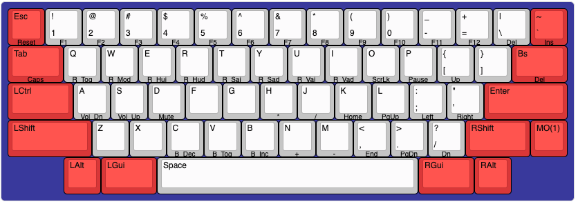

# qmk_firmware

## OK60 HHKB

* default
    - CapslockキーをMO(1) + Tabキーに割り当て

    `make ok60_hhkb:default`

* idle_timer
    - 30秒でバックライトが自動消灯
    - 5分でRGBライトが自動消灯
    
    `make ok60_hhkb:idle_timer`

## Keymap

* 販売者が提供していた [ok60hhkbgeneral.json](https://drive.google.com/drive/folders/1Q5DB_8TYcfBhLp6e71Q-hT_8XrNDXHnk) のCapslockの割当をLayer1のTabキーに変更しました。
