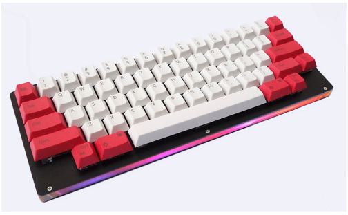

# qmk_firmware



## OK60 HHKB

    * CapslockキーをMO(1) + Tabキーに割り当て
    * 30秒でバックライトが自動消灯
    * 5分でRGBライトが自動消灯

    `make ok60_hhkb:default`

    * アイドルタイマーが不要な場合は、下記のようにrules.mkのIDLE_TIMER_ENABLEをコメントアウトしてください。 

        * バックライトとRGBライトのアイドルタイマーは無効です。
            ```
            #IDLE_TIMER_ENABLE = yes
            ```  

## Keymap


* 販売者が提供していた [ok60hhkbgeneral.json](https://drive.google.com/drive/folders/1Q5DB_8TYcfBhLp6e71Q-hT_8XrNDXHnk) のCapslockの割当をLayer1のTabキーに変更しました。
